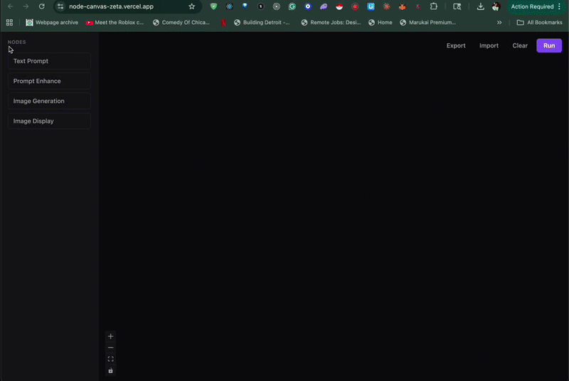

# Node Canvas

A node-based visual canvas for chaining AI image generations. Built in a day as a take-home.

[Live demo](https://node-canvas-zeta.vercel.app)



## Quick start

```bash
pnpm install
cp .env.example .env.local   # add FAL_KEY and OPENAI_API_KEY
pnpm dev:full                # vercel dev — frontend + API proxy on :5173
```

`pnpm dev:full` requires a one-time `vercel login`. Use `pnpm dev` for frontend-only work without the image generation API.

## Architecture

Three decisions shape this codebase:

- **The execution engine (`src/engine/`) is pure TypeScript.** No React, no DOM, no `fetch`. It takes a workflow graph, topologically sorts it, and walks the result calling registered runners. That means the orchestration logic is unit-testable in milliseconds with mocked runners.
- **Executable nodes and display sinks are a compile-time distinction.** `RunnerRegistry` only accepts keys from `ExecutableNodeType` — you cannot register a runner for `imageDisplay`. The type system prevents a whole class of mistakes.
- **Zustand is the single source of truth.** React Flow renders from the store and dispatches changes back. The store never derives state from React Flow — one direction, one owner.

See [ARCHITECTURE.md](./ARCHITECTURE.md) for the full walkthrough and [SPEC.md](./SPEC.md) for the pre-implementation technical spec.

## Stack

| Layer | Choice | Why |
|---|---|---|
| Build | Vite | Fast, zero-config for React/TS |
| Language | TypeScript (strict, noUncheckedIndexedAccess) | Catches real bugs; discriminated unions drive the domain model |
| Canvas | @xyflow/react | De facto for node-based UIs; saves weeks of drag/connect/zoom work |
| State | Zustand | Idiomatic with React Flow; simpler than Redux for a single-store app |
| Styling | Tailwind CSS | Fast iteration, no CSS file sprawl |
| AI — image | fal.ai (flux/schnell) | Cheap, fast, simple REST |
| AI — text | OpenAI (gpt-4o-mini) | Prompt enhancement via chat completions |
| Tests | Vitest + Testing Library | Vite-native, fast feedback loop |
| Deploy | Vercel | Zero-config for Vite + serverless functions as API proxy |

## What's out of scope

These are deliberate scope cuts, not oversights.

- **Auth / accounts** — single-user local tool for the demo. Would add Postgres + NextAuth if productionizing.
- **Backend database** — localStorage with a version field is enough at this scale. The persistence layer is designed for easy migration.
- **Real-time collaboration** — would reach for Yjs or Liveblocks.
- **Undo/redo** — would implement as a command stack over the Zustand store.
- **Video models** — the runner registry pattern makes this a single-file addition.
- **Mobile layout** — desktop-only for a technical demo.
- **Run cancellation** — `AbortSignal` is plumbed through `RunContext` but not wired to the UI. One-line change when needed.

## Testing

29 tests across 6 files. Coverage focuses on where logic lives: the execution engine (topological sort, workflow runner, error isolation, input propagation), persistence (round-trip, version migration, corrupt-data fallback), and node runners (mocked fetch, error paths). React components aren't unit-tested — React Flow owns the interaction layer, and the components are thin wiring on top of it.

```bash
pnpm test         # single run
pnpm test:watch   # watch mode
pnpm verify       # lint + typecheck + test
```

## Project structure

```
src/
  app/
    App.tsx              # shell: sidebar + canvas
    Canvas.tsx           # React Flow ↔ store wiring, Run/Clear buttons
    Sidebar.tsx          # node palette
  engine/                # pure TypeScript — no React, no DOM
    types.ts             # RunContext, NodeRunner, RunnerRegistry, CycleError
    topoSort.ts          # Kahn's algorithm with cycle detection
    runWorkflow.ts       # walks topo order, gathers inputs, calls runners
  nodes/
    registry.ts          # node type → component + runner mapping
    StatusBadge.tsx      # shared status indicator
    textPrompt/          # component + passthrough runner
    promptEnhance/       # component + OpenAI runner
    imageGeneration/     # component + fal.ai runner
    imageDisplay/        # component only (sink — no runner)
  store/
    useAppStore.ts       # single Zustand store
    persistence.ts       # localStorage with version field, debounced save
  types.ts               # domain types: WorkflowNode, Edge, Workflow
  lib/
    api.ts               # fetch client for /api/generate/*
    id.ts                # nanoid wrapper
api/
  generate/
    image.ts             # Vercel serverless — proxies fal.ai, keeps key server-side
    text.ts              # Vercel serverless — proxies OpenAI for prompt enhancement
```
